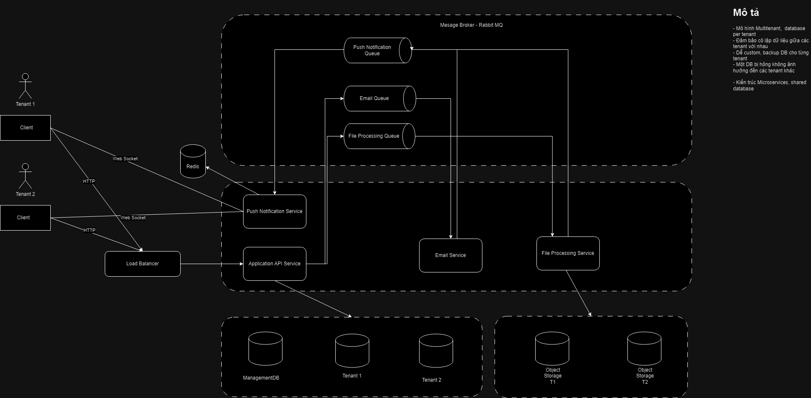

# Tài liệu thiết kế hệ thống

## Thiết kế giao diện

Figma: [link](https://www.figma.com/file/s4yLxOYyBSr2lkatYV6PrY/H%E1%BB%87-th%E1%BB%91ng-qu%E1%BA%A3n-l%C3%BD-kh%C3%B3a-lu%E1%BA%ADn-t%E1%BB%91t-nghi%E1%BB%87p?type=design&node-id=1%3A7&mode=design&t=4TMEpi86HXe0l6UG-1)

## Cơ sở dữ liệu

DB Diagram: [link](https://dbdiagram.io/d/QLKLTN-65b78ac0ac844320aef0821d)

## Kiến trúc hệ thống

